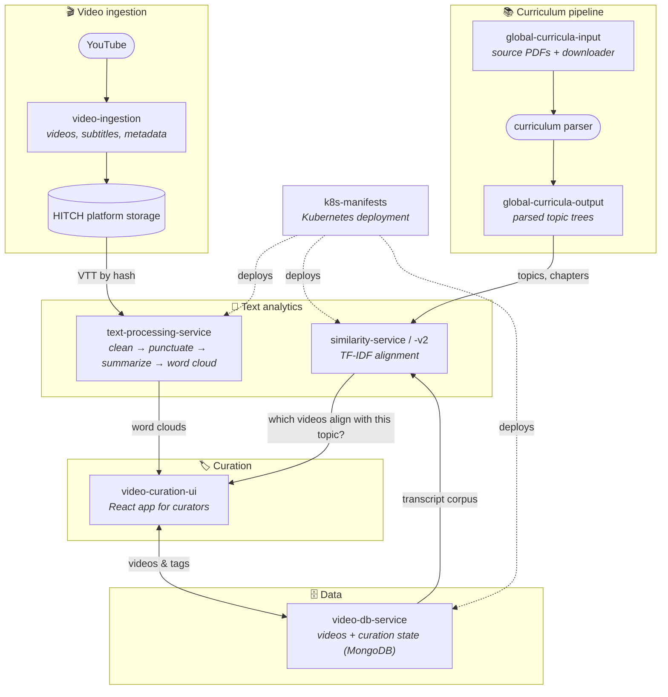

  
  <h1>HITCH Tech</h1>
  
<strong>Access the world's best educational videos — aligned with the curricula students are taught.</strong>

  
<a href="https://hitch.video">hitch.video</a>

[HITCH](https://hitch.video) is an educational video platform built for the whole learning ecosystem — helping parents catalyze potential, students build knowledge, teachers bring the world into the classroom, and school administrators reinforce the curriculum.

This organization holds one part of the engineering behind the platform: the systems that **align educational videos with official curricula** from around the world. Curriculum documents are parsed into structured topic trees; videos are ingested with their subtitles and distilled into transcripts, summaries, word clouds, and vector representations; a similarity engine and a human curation workflow bring the two together, by subject, grade, and topic. The stack is applied machine learning end to end — neural punctuation restoration, transformer (BERT) sentence embeddings, TF-IDF vector retrieval — with humans kept in the loop where judgment matters.

> These repositories cover the curriculum-alignment and video-analysis systems. Other components of the HITCH platform are maintained outside this organization, and several repositories here are private.

## System Map

## Repositories

### Curriculum-alignment pipeline

| Repository | What it is |
|---|---|
| [global-curricula-input](https://github.com/hitchtech/global-curricula-input) | Curriculum PDFs collected worldwide + the downloader utility. |
| [global-curricula-output](https://github.com/hitchtech/global-curricula-output) | Parsed curricula: structured topic trees per subject (Nigeria WASSCE to date). |
| [video-ingestion](https://github.com/hitchtech/video-ingestion) | Downloads videos, subtitles, and metadata into the content store. |
| [text-processing-service](https://github.com/hitchtech/text-processing-service) | Subtitle cleaning, punctuation restoration, summarization, word clouds (REST). |
| [similarity-service](https://github.com/hitchtech/similarity-service) | TF-IDF alignment of videos with tags, textbook PDFs, and chapters. |
| [similarity-service-v2](https://github.com/hitchtech/similarity-service-v2) | Successor with cloud-stored corpus artifacts and Kubernetes deployment. |
| [video-db-service](https://github.com/hitchtech/video-db-service) | REST CRUD over the MongoDB store of videos and curation state. |
| [video-curation-ui](https://github.com/hitchtech/video-curation-ui) | React app where curators watch, review word clouds, and tag videos. |
| [k8s-manifests](https://github.com/hitchtech/k8s-manifests) | Kubernetes manifests deploying the three core services. |

### Early experiments & predecessors

| Repository | What it is |
|---|---|
| [subtitle-parsing-notebooks](https://github.com/hitchtech/subtitle-parsing-notebooks) | First notebooks converting `.vtt` subtitles to clean transcripts. |
| [subtitle-web-ui](https://github.com/hitchtech/subtitle-web-ui) | Flask UI for transcript cleaning and keyword extraction. |
| [subtitle-summarizer](https://github.com/hitchtech/subtitle-summarizer) | Notebook pipeline: transcript → punctuation → extractive summary. |
| [video-tagging-prototype](https://github.com/hitchtech/video-tagging-prototype) | Early Flask tagging form, superseded by video-curation-ui. |
| [text-analytics-monolith](https://github.com/hitchtech/text-analytics-monolith) | The all-in-one API later split into the three services above. |

### Operations

| Repository | What it is |
|---|---|
| [ovpn-monitoring](https://github.com/hitchtech/ovpn-monitoring) | OpenVPN session logging, usage totals, and shared-account detection. |

## Contributors

The systems here were designed and built by a small team, and they should be proud of the work — thank you:

- **Steve Veerman** — [@veerman](https://github.com/veerman)
- **Blake Vollbrecht** — [@BlakeVollbrecht](https://github.com/BlakeVollbrecht)
- **William (Billy) Parmenter** — [@billyParmenter](https://github.com/billyParmenter)
- **Parth Darji** — [@parthu34](https://github.com/parthu34)
- **Nasarinbahen Kureshi** — [@NasrinHitch](https://github.com/NasrinHitch)
- **Philip Arff** — [@parff9850](https://github.com/parff9850)
